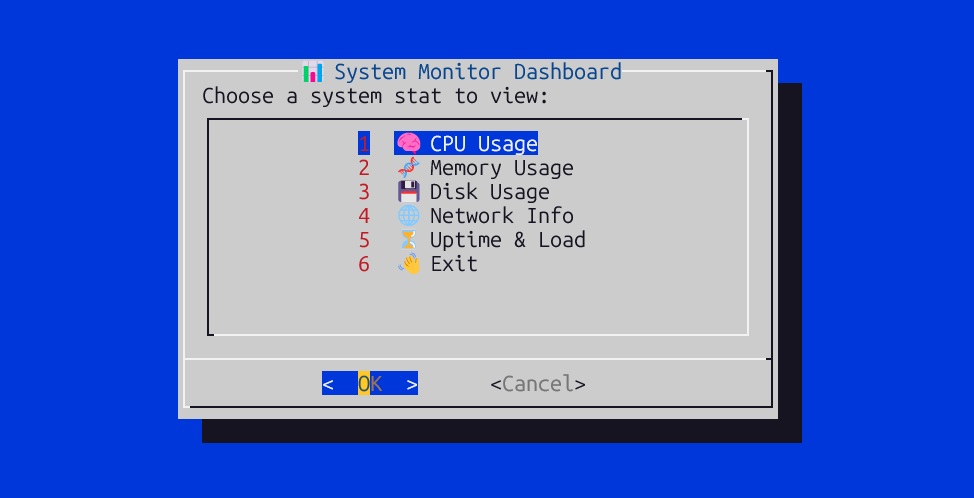

# 🖥️ System Monitor Dashboard (Terminal-Based)

A beginner-friendly Linux terminal-based system monitor written in **Bash**, using `dialog`.

## 📸 Demo



## 🔧 Features

- CPU Usage
- RAM and Swap Usage
- Disk Space
- Network Statistics
- Simple Menu using `dialog`

## 🛠️ Requirements

- Linux (Ubuntu, Debian, etc.)
- `bash` shell
- `dialog` (Install using `sudo apt install dialog`)

## 🚀 How to Run

```bash
chmod +x monitor.sh
./monitor.sh


## 📁 Folder Structure

system-monitor/
│
├── monitor.sh           # Main script
├── screenshots/         # (You will add this!)
│   └── dashboard.png
└── README.md
